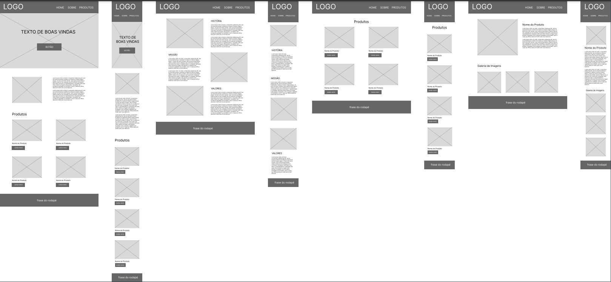

# Avaliação: Criação de Site Baseado em Wireframe
 
Site criado usando um wireframe base fornecido pelo professor 
 

## Índice
- <a href="#autor-do-projeto">Autor do Projeto</a>
- <a href="#wireframe">Wireframe</a>
- <a href="#como-acessar">Como Acessar?</a>
- <a href="#ferramentas-utilizadas">Ferramentas Utilizadas</a>

## Autor do Projeto
Autor: Vinicius Vieira Murara 
Turma: AI PSIN MI-75

## Wireframe

## Como Acessar?

Passo 1: Baixar o arquivo zipado 
Passo 2: Descompactar o arquivo zipado 
Passo 3: Instalar o Visual Studio Code 
Passo 4: Abrir a pasta descompactada no Visual Studio Code 
Passo 5: Instalar a extensão do Live Server 
Passo 6: Rodar o index.html com o Go Live

## Ferramentas Utilizadas
1. [Visual Studio Code](https://code.visualstudio.com/)
2. [Github](https://github.com/)
3. [Github Desktop](https://github.com/apps/desktop)